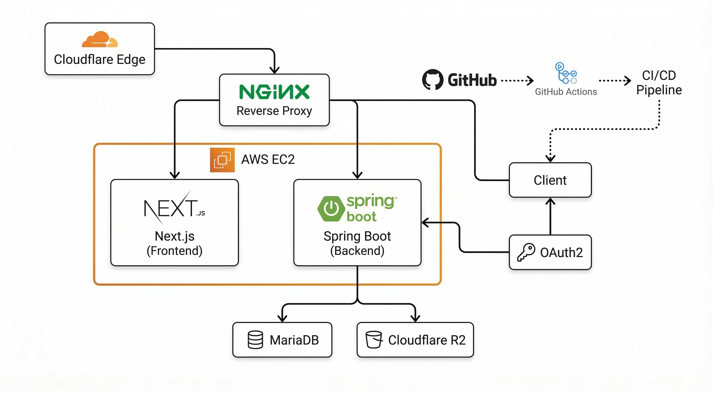
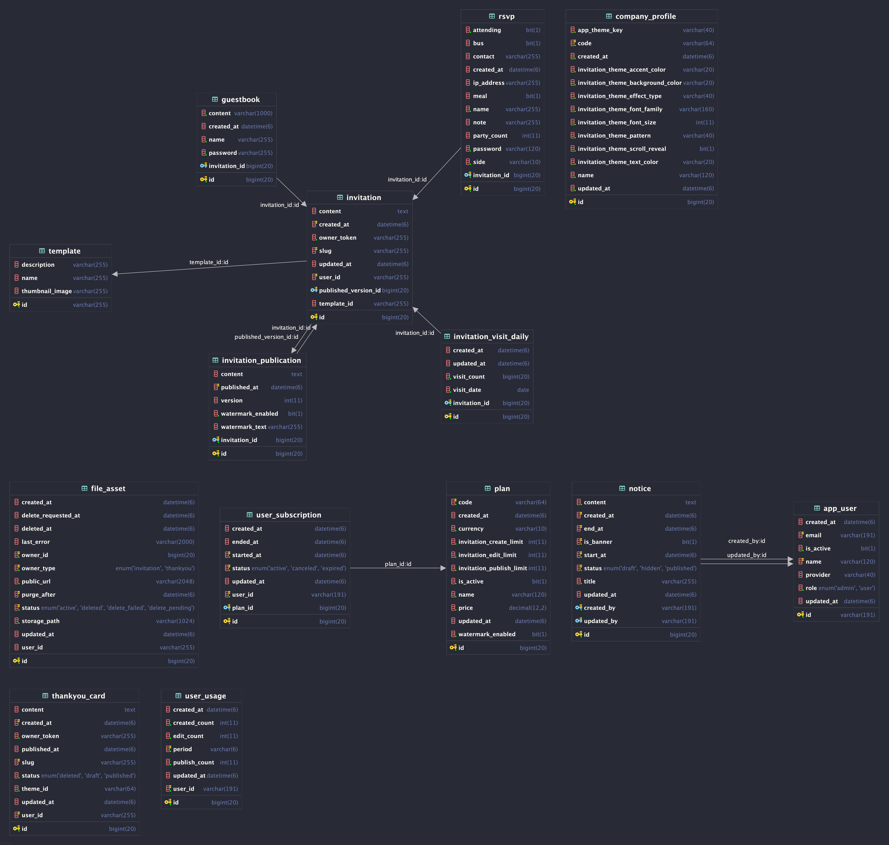
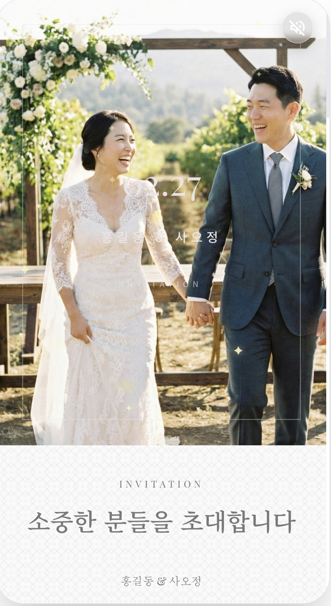
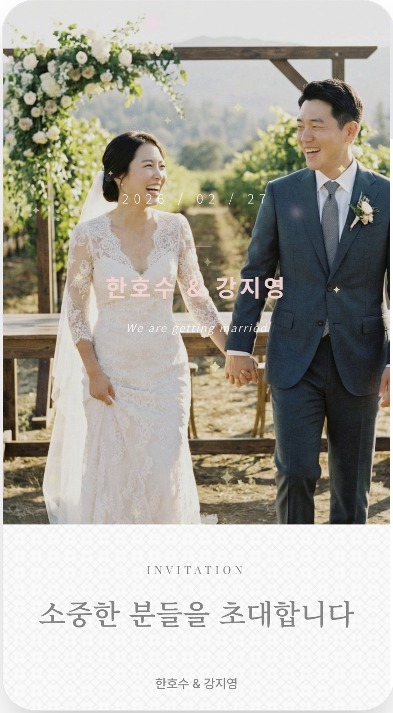
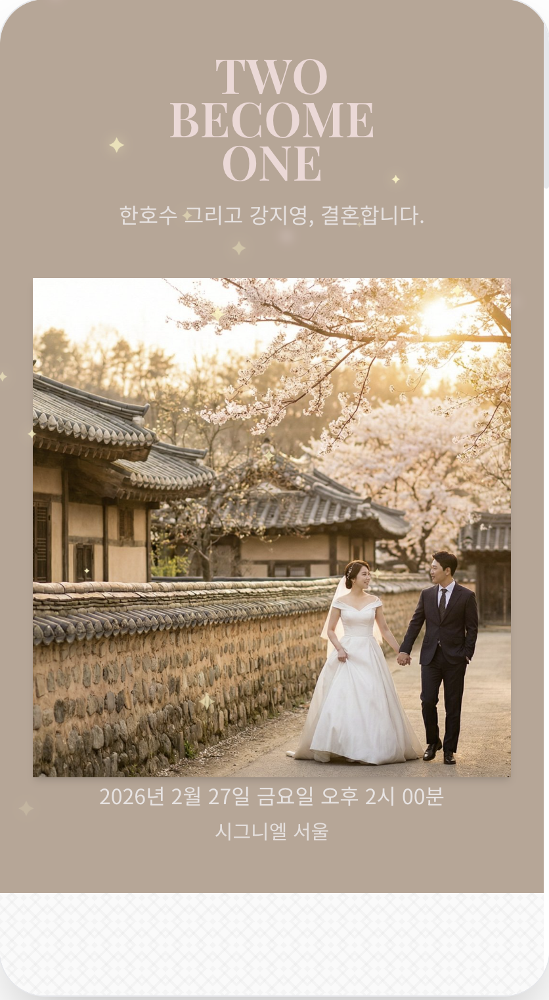
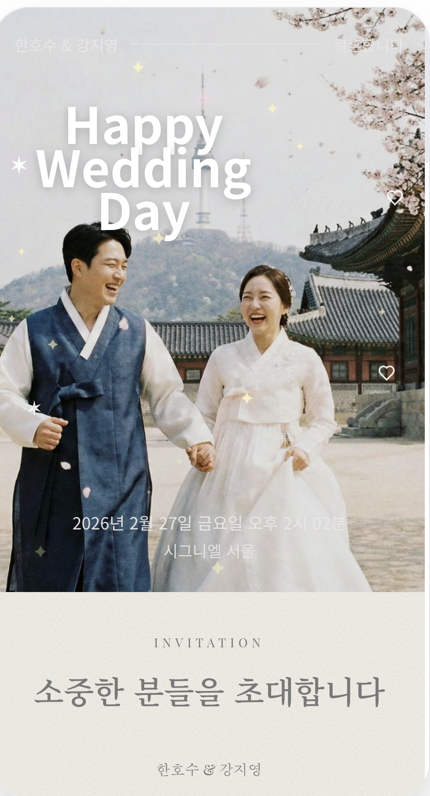

# Vowory

> 로고를 클릭하면 서비스 페이지로 이동합니다.

  

  
  
  
  
  
  

**Vowory**는 [`https://vowory.com`](https://vowory.com) 에서 운영 중인 모바일 청첩장 제작 서비스입니다.

- 예비부부가 직접 청첩장을 생성하고 수정하고 발행할 수 있습니다.
- RSVP, 방명록, 방문 통계, 감사장, 공지 기능이 있습니다..
- 하객은 모바일 환경에서 예식 정보, 갤러리, 지도, 계좌, 교통 정보를 한 번에 확인할 수 있습니다.

## Structure

  

1. 사용자 요청은 Cloudflare를 거쳐 AWS EC2에 들어오고, EC2 내부의 Nginx가 Next.js와 Spring Boot로 요청을 분기합니다.
2. Next.js는 사용자 화면을 담당하고, Spring Boot는 인증, 청첩장/감사장, RSVP, 방명록, 공지 API를 처리합니다. 로그인은 Google / Kakao OAuth2와 JWT 쿠키 기반으로 동작합니다.
3. 핵심 데이터는 MariaDB에 저장하고, 이미지와 파일 자산은 Cloudflare R2에 저장합니다. 배포는 GitHub Actions 기반 CI/CD로 EC2에 반영합니다.

## ERD

  

1. `app_user`, `plan`, `user_subscription`, `user_usage`는 사용자, 구독 플랜, 월별 사용량을 관리합니다. 구독 정보와 사용량을 분리해 플랜 정책과 제한 계산을 단순하게 유지했습니다.
2. `invitation`은 편집 중인 청첩장 초안이고, `invitation_publication`은 실제 공개 중인 발행본입니다. 초안과 공개본을 분리해 편집 중 변경이 바로 노출되지 않도록 했습니다.
3. `rsvp`, `guestbook`, `invitation_visit_daily`는 청첩장에 연결되는 공개 반응 데이터입니다. 방문 수는 일별 집계 테이블로 관리해 통계 조회를 단순하게 만들었습니다.
4. `thankyou_card`는 감사장 전용 도메인이고, `file_asset`은 청첩장/감사장에서 공통으로 사용하는 업로드 파일 메타데이터입니다. 파일은 소유 타입과 상태값으로 관리해 공통 처리와 삭제 예약이 가능하도록 구성했습니다.
5. `notice`는 운영 공지, `company_profile`은 공통 브랜딩과 기본 테마 설정을 담당합니다. ERD 이미지의 보조 테이블까지 포함하면 전체 스키마를 볼 수 있지만, 실제 핵심 흐름은 위 도메인들을 중심으로 돌아갑니다.

## 기술스택

### Frontend

- Next.js
- React
- TypeScript

### Backend

- Spring Boot
- Kotlin
- Spring Security
- Spring Data JPA
- Querydsl

### Data / Infra

- MariaDB
- Redis
- AWS EC2
- Cloudflare R2
- Cloudflare DNS / CDN

## 샘플

| Sample 1 | Sample 2 | Sample 3 |
| --- | --- | --- |
|  |  |  |

| Sample 4 | Sample 5 |
| --- | --- |
|  |  | 

## 주요 기능

- [x] Google / Kakao OAuth 로그인
- [x] 청첩장 초안 생성
- [x] 청첩장 수정 및 발행 / 비공개 전환
- [x] 예식 정보, 인사말, 갤러리, 계좌, 지도, 교통 정보 커스터마이징
- [x] 폰트, 색상, 히어로 섹션, 오프닝 화면 커스터마이징
- [x] 공개 청첩장 URL 공유
- [x] RSVP 등록 / 삭제
- [x] 방명록 등록 / 삭제
- [x] 방문 수 기록 및 대시보드 통계
- [x] 감사장 작성 / 발행
- [x] 공지사항 목록 / 배너 / 상세 조회
- [x] 관리자 사용자 관리
- [x] 관리자 공지 관리
- [x] RSVP CSV 다운로드
