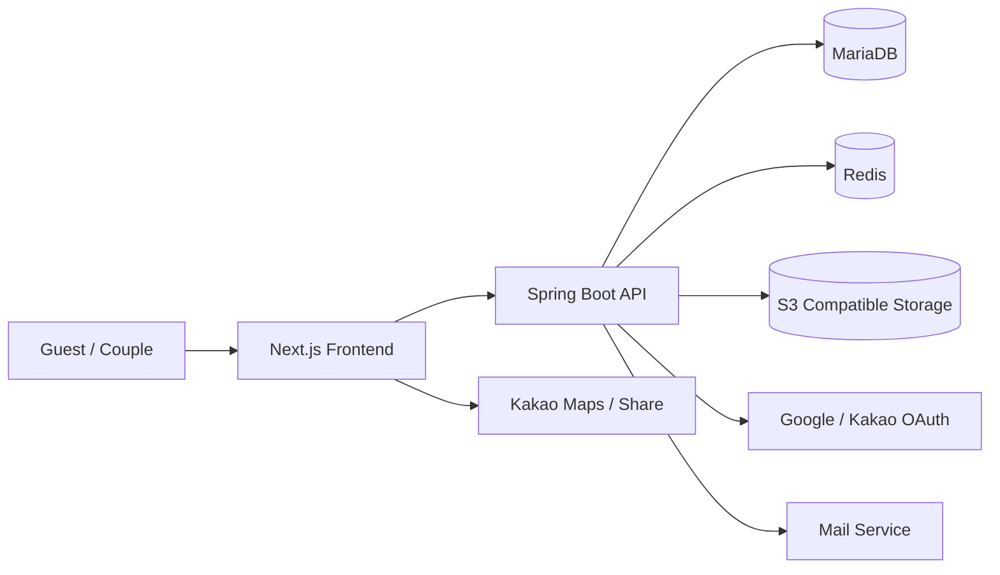
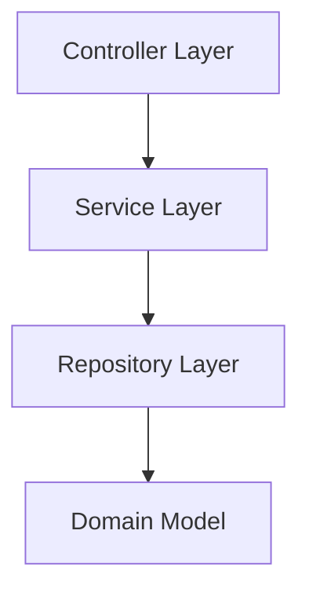

# 💌 Wedding Letter

> 로고를 클릭하면 서비스 페이지로 이동합니다.

<p align="center">
  <a href="https://vowory.com">
    
  </a>
</p>

<p align="center">
  
  
  
  
  
  
</p>

**Wedding Letter**는 [`https://vowory.com`](https://vowory.com) 에서 운영 중인 모바일 청첩장 제작 서비스입니다.

- 예비부부가 직접 청첩장을 생성하고 수정하고 발행할 수 있습니다.
- 하객은 모바일 환경에서 예식 정보, 갤러리, 지도, 계좌, 교통 정보를 한 번에 확인할 수 있습니다.
- RSVP, 방명록, 방문 통계, 감사장, 공지 기능까지 포함한 운영형 웨딩 플랫폼입니다.

## Preview

| Sample 1 | Sample 2 | Sample 3 |
| --- | --- | --- |
|  |  |  |

| Sample 4 | Sample 5 | Landing |
| --- | --- | --- |
|  |  |  |

## Project Architecture



- `Frontend`는 랜딩 페이지, 청첩장 에디터, 공개 청첩장, 마이페이지, 감사장 화면을 제공합니다.
- `API`는 인증, 청첩장/감사장 발행, RSVP, 방명록, 공지, 관리자 기능을 담당합니다.
- `MariaDB`는 핵심 서비스 데이터를 저장하고, `Redis`는 보조 데이터 저장소로 사용됩니다.
- 이미지 및 미디어 자산은 S3 호환 스토리지에 저장합니다.

## 3-Layered Architecture



- `Controller`
  API 엔드포인트, 인증 검사, 요청/응답 처리
- `Service`
  청첩장 발행, RSVP/방명록 관리, 감사장 생성, 관리자 기능 등 비즈니스 로직
- `Repository / Domain`
  JPA 엔티티, Querydsl 조회, 영속성 처리

## API Domains

| Domain | Endpoint Prefix | Description |
| --- | --- | --- |
| Auth | `/api/auth` | 로그인 상태 조회, 로그아웃 |
| Public Invitation | `/api/public/invitations` | 공개 청첩장 조회, RSVP, 방명록, 방문 기록 |
| Invitation Owner | `/api/invitations` | 청첩장 생성, 수정, 발행, 대시보드, CSV 다운로드 |
| Public Thankyou | `/api/public/thankyou-cards` | 공개 감사장 조회 |
| Thankyou Owner | `/api/thankyou-cards` | 감사장 생성, 수정, 발행 |
| Public Notice | `/api/public/notices` | 공지 목록, 배너, 상세 조회 |
| Admin | `/api/admin/users`, `/api/admin/notices` | 사용자 관리, 공지 관리 |

## Tech Stack

### Frontend

| Stack | Usage |
| --- | --- |
| Next.js 16 | App Router 기반 웹 서비스 |
| React 19 | 에디터, 공개 페이지, 마이페이지 UI |
| TypeScript | 타입 안정성 확보 |
| Tailwind CSS 4 | 스타일링 |

### Backend

| Stack | Usage |
| --- | --- |
| Spring Boot 3.5.10 | API 서버 |
| Kotlin 2.3.0 | 백엔드 주요 언어 |
| Spring Security | 인증 및 권한 처리 |
| OAuth2 Client | Google / Kakao 소셜 로그인 |
| Spring Data JPA | 도메인 영속성 |
| Querydsl | 관리자/목록성 조회 |
| Flyway | DB 마이그레이션 |

### Data / Infra

| Stack | Usage |
| --- | --- |
| MariaDB | 핵심 서비스 데이터 저장 |
| Redis | 보조 데이터 저장소 |
| S3 Compatible Storage | 청첩장/감사장 이미지 및 파일 저장 |
| Actuator | 상태 확인 및 운영 메트릭 |
| Mail | 운영/알림 메일 처리 |

### External Integration

| Service | Usage |
| --- | --- |
| Google OAuth | 사용자 로그인 |
| Kakao OAuth | 사용자 로그인 |
| Kakao Maps | 위치 표시 |
| Kakao Share | 청첩장 공유 |

## 주요 기능

- [x] Google / Kakao OAuth 로그인
- [x] 청첩장 초안 생성
- [x] 청첩장 수정 및 발행 / 비공개 전환
- [x] 예식 정보, 인사말, 갤러리, 계좌, 지도, 교통 정보 커스터마이징
- [x] 폰트, 색상, 히어로 섹션, 오프닝 화면 커스터마이징
- [x] 공개 청첩장 URL 공유
- [x] RSVP 등록 / 삭제
- [x] 방명록 등록 / 삭제
- [x] 방문 수 기록 및 대시보드 통계
- [x] 감사장 작성 / 발행
- [x] 공지사항 목록 / 배너 / 상세 조회
- [x] 관리자 사용자 관리
- [x] 관리자 공지 관리
- [x] RSVP CSV 다운로드

## Directory

```text
vowory/
├─ build.gradle.kts
├─ settings.gradle.kts
├─ src/
│  └─ main/
│     ├─ kotlin/
│     │  └─ com/gh/wedding/
│     │     ├─ controller/
│     │     ├─ service/
│     │     ├─ repository/
│     │     ├─ domain/
│     │     └─ security/
│     └─ resources/
└─ frontend/
   ├─ src/
   │  ├─ app/
   │  ├─ components/
   │  └─ lib/
   └─ public/
```

## Run Locally

### Backend

```bash
./gradlew bootRun
```

- 기본 포트: `10001`

### Frontend

```bash
cd frontend
npm install
npm run dev
```

`frontend/.env.local`

```env
NEXT_PUBLIC_SITE_URL=http://localhost:9000
NEXT_PUBLIC_API_BASE_URL=http://localhost:10001
WEDDING_API_BASE_URL=http://127.0.0.1:10001
```

## Environment Notes

실행 전에 아래 설정이 필요합니다.

- MariaDB 연결 정보
- Redis 연결 정보
- JWT 시크릿
- Google / Kakao OAuth 클라이언트 정보
- S3 호환 스토리지 정보
- 메일 발송 정보

## Service

- Production: [`https://vowory.com`](https://vowory.com)
- Frontend local: [`http://localhost:9000`](http://localhost:9000)
- Backend local: `http://localhost:10001`

## Update

- Project version: `0.0.1-SNAPSHOT`
- README updated: `2026-03-18`
- Root repository: `vowory`
